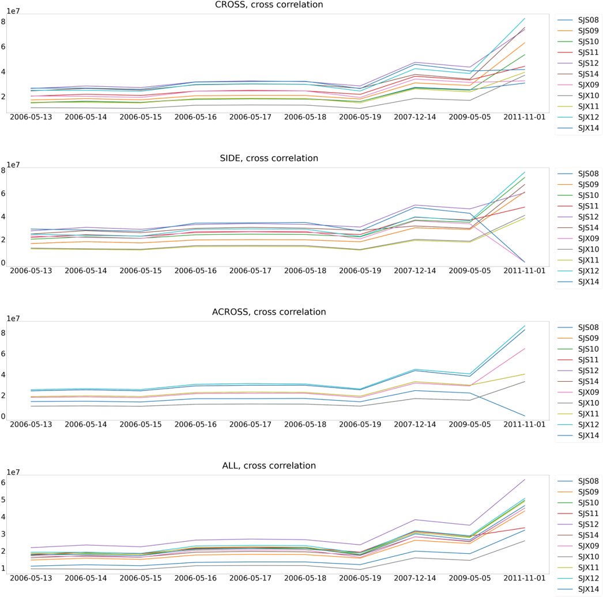

# AnomalyCableDetection

This repository is developed for The 1st International Project Competition for Structural Health Monitoring (IPC-SHM, 2020), and we won second place.


### Dataset

We have a cable tension dataset monitored from an in-service cable-stayed bridge in China, which is a double-tower and double-cable-plane cable-stayed bridge that consists of 168 stay cables (84 pairs). The published dataset in MATLAB ‘.mat’ format contains the monitored cable tension data of a group of cables (14 cables of SJS08 to SJS14 and SJX08 to SJX14) for 10 days (2006-05-13 to 2006-05-19, 2007-12-14, 2009-05-05, and 2011-11-01), and monitoring data in each day is saved in a separate mat file. Each mat file contains a 1x1 structured dataset with 2 fields named as ‘CF’, in which ‘CF.Data’ is the time-varying cable tension data and ‘CF.Sensor’ denotes the cable number. The sampling frequency is 2 Hz. Figure 3.2 illustrates a classical time-varying cable tension measured by load cell incorporated between cable and anchorage of SJS10 in 2006-05-15, in which red solid line is the trend item (dead load effects and environmental effects) and the blue peaks are the vehicle-induced cable tension.

Detailed information of dataset is in [here](docs/Announcement%20of%20the%201st%20IPC-SHM%202020.pdf)


### Goal

One out of the 14 cables was found damaged (the damage is rupture of wires) in the year 2011. Participants are required to identify which cable is damaged based on the published dataset. Details on the data preprocessing, the feature extraction, and the statistical model should be included in the submitted paper and will be evaluated together with the identification results.


### STL decomposition with cross-correlation




### GMM

Fitted GMM graph on cable tention ratio.


GMM results


GMM code is based on this paper:

```
@article{li2018condition,
    title={Condition assessment of cables by pattern recognition of vehicle-induced cable tension ratio},
    author={Li, Shunlong and Wei, Shiyin and Bao, Yuequan and Li, Hui},
    journal={Engineering Structures},
    volume={155},
    pages={1--15},
    year={2018},
    publisher={Elsevier}
}
```


